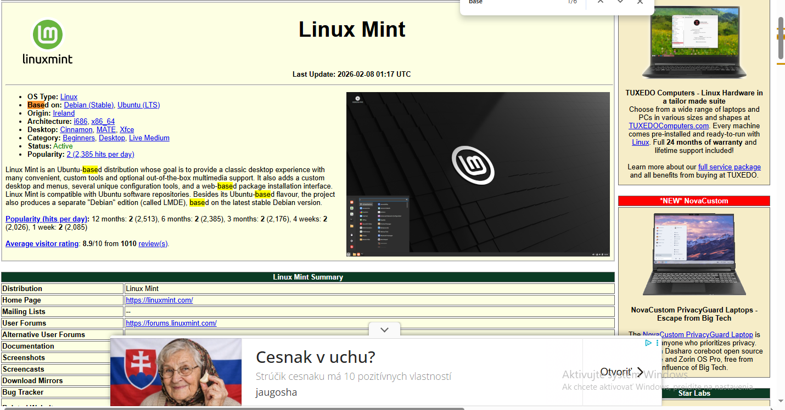

# Cvičenie: Linux — základy, GNU/GPL a distribúcie

---

## Úloha 1 — Pojmy GNU a GPL

### 1.1 Rozdiel „free as in freedom" vs. „free as in beer"

**free as in freedom:**
Sloboda používať a šíriť softvér.

**free as in beer:**
Softvér je zadarmo, ale nemusí byť slobodný.

### 1.2 Čo znamená skratka GPL (celý anglický názov)?

 General Public License

### 1.3 Prečo sa Linux niekedy označuje ako „GNU/Linux" a nielen „Linux"?

Pretože Linux je iba jadro a GNU poskytuje nástroje a programy, ktoré tvoria celý operačný systém.

---

## Úloha 2 — Práca s distrowatch.com

### 2.1 Na akej distribúcii je postavený Linux Mint?

Ubuntu 

### 2.2 Poradie Linux Mint v rebríčku „Page Hit Ranking — Last 6 months"

- **Poradie:** 2
- **Hodnota** (priemerná návštevnosť/deň): cca 2385

### 2.3 Distribúcia z inej rodiny ako Debian

| Položka | Tvoja odpoveď |
|---|---|
| Názov distribúcie | Fedora |
| Rodina (Red Hat / Arch / SUSE / iná) | Red Hat |
| Balíčkovací systém (apt / dnf / pacman / zypper / iný) | dnf |

---

## Úloha 3 — Prihlásenie a odhlásenie

### 3.1 Aká obrazovka sa zobrazila po odhlásení? Čo si na nej videl?

Prihlasovacia obrazovka s výberom používateľa a zadaním hesla.

### 3.2 Bola plocha po opätovnom prihlásení rovnaká, alebo „čistá" (zatvorené všetky okná)?

čistá (nové okná)

---

## Úloha 4 — Tri spôsoby spustenia konzoly

### 4.1 Menu → Terminal

Aký je presný názov aplikácie v záhlaví okna?

Terminal

### 4.2 Klávesová skratka `Ctrl + Alt + T`

Otvoril sa rovnaký program ako v 4.1?

 áno

### 4.3 TTY (`Ctrl + Alt + F3`)

**Aspoň 2 rozdiely medzi TTY a grafickým terminálom:**

1. TTY je iba textové rozhranie bez grafiky.
2. Grafický terminál beží v grafickom prostredí (GUI).

**Cez ktoré F-tlačidlo si sa vrátil späť do GUI?**

F7

---

## Úloha 5 — Čítanie promptu

### 5.1 Výstupy príkazov

Skopíruj výstup z terminálu sem:
$ whoami
student

$ hostname
linux-pc

$ pwd
/ home / student

$ echo $USER
student

### 5.2 Aký znak je na konci tvojho promptu?

`$`

### 5.3 Čo tento znak hovorí o tvojich právach v systéme?

Znamená to, že som prihlásený ako bežný používateľ.

### 5.4 Čítanie promptu

- meno používateľa: student
- názov počítača: linux-pc
- aktuálny adresár: / home / student
- typ používateľa: $

---

## Záver

Čo bolo pre teba dnes nové alebo zaujímavé?

Nové bolo pochopenie rozdielu medzi GNU a Linuxom
